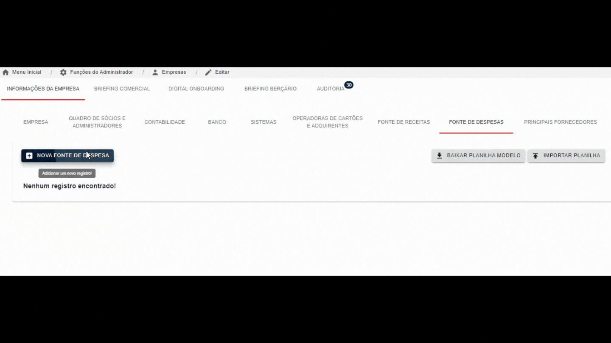

<h1 align="center">
    Digital do Cliente
</h1>

<h4 align="center">
  🚀 Implementação da Digital do Cliente, convertendo planilha mal estruturada para o sistema iTag.
</h4>

 

## 💻 Projeto

O objetivo dessa implementação, foi a necessidade do usuário em querer converter uma planilha grande e mal estruturada dos dados dos clientes para o sistema chamado iTag.
A implementação foi realizada com êxito e agora o cliente não precisará mais utilizar a planilha e irá começar a utilizar o sistema.

## :rocket: Tecnologias

Esse projeto foi desenvolvido com as seguintes tecnologias:

- [Node.js](https://nodejs.org/en/)
- [Adonis.js](https://adonisjs.com/)
- [SQL Server](https://www.microsoft.com/en-us/sql-server/sql-server-downloads?SilentAuth=1&wa=wsignin1.0)
- [Styled Components](https://styled-components.com/)
- [React.js](https://reactjs.org/)
- [Redux](https://redux.js.org/)
- [React Router](https://reactrouter.com/)

Demonstração abaixo de um usuário de `teste` dentro do sistema.

   
   

## Build do projeto
Esse projeto foi realizado a build na Digital Ocean https://www.digitalocean.com/

---

Desenvolvido por Felipe Miguel DS :wave: [Portfolio](https://felipemiguel.vercel.app/)
